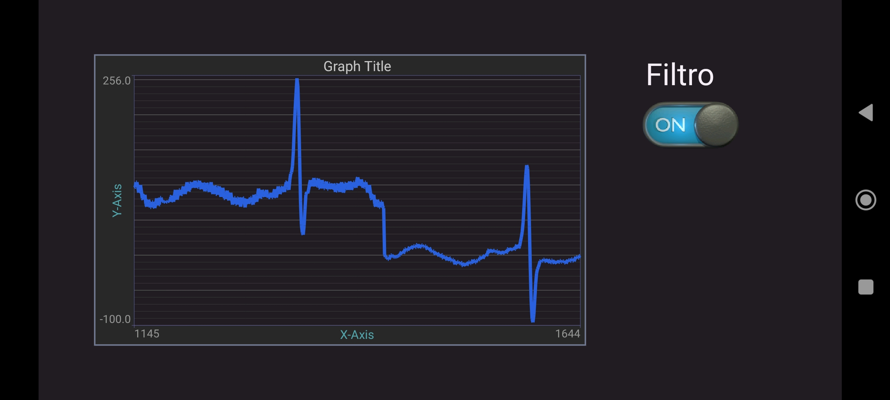

# Ejemplo Bluetooth - Filtros

Este proyecto ejemplifica el uso del módulo de comunicación Bluetooth Low Energy (BLE), junto con el de filtrado de una señal.
Permite graficar en una aplicación móvil la una señal temporal y activar y desactivar el filtrado (pasabanda) de la misma.

## Cómo usar el ejemplo

### Hardware requerido

* ESP-EDU
* Dispositivo Android

### Configurar el proyecto

Para poder utilizar las funcionalidades de BLE en el ESP32, en primer lugar es necesario habilitar dicho módulo en el `sdkconfig`. Para ello puede copiar el `sdkconfig` de este proyecto (que ya se encuentra modificado) o modificar el propio:

1. Abrir `ESP-IDF: SDK Configuration Editor`: 
2. Buscar "Bluettoth" y habilitar la casilla `Bluetooth`
3. Buscar "4.2" y habilitar la casilla `Enable BLE 4.2 features`

Paso seguido debe modificar el `CMakeLists` de la carpeta `drivers`, descomentando la línea:

```cmake
#"microcontroller/src/ble_mcu.c"
```

Para utilizar las funcionalidades de DSP es necesario agregar la capa middelware al proyecto, modificando el archivo CMakeLists.txt (ubicado en la raiz del proyecto) con el siguiente contenido:

```cmake
 cmake_minimum_required(VERSION 3.16)

list(APPEND EXTRA_COMPONENT_DIRS "../../drivers")
list(APPEND EXTRA_COMPONENT_DIRS "../../middelware")

include_directories(${PROJECT_NAME} ../../drivers)
include_directories(${PROJECT_NAME} ../../middelware)
include($ENV{IDF_PATH}/tools/cmake/project.cmake)
project(ej_dsp)
```

En este proyecto ya se han realizado estas modificaciones, por lo tanto no es necesaria ninguna acción extra para probarlo.

### Ejecutar la aplicación

1. Instalar y ejecutar en el dispositivo Android la aplicación [Bluetooth Electronics](https://play.google.com/store/apps/details?id=com.keuwl.arduinobluetooth)
2. Presionando en el botón `Connect`, vincular el móvil con la placa (se mostrará con el nombre `ESP_EDU_1`)
3. Crear un nuevo Panel que contenga un Gráfico "Roll" (menú `Graphs`) y un switch (menú `Switches`) que envíe una "A" cuando esté en "ON" y una "a" cuando esté en "OFF".

4. Ejecutar este panel. Verá la grafica de un ECG (con continua y ruido). Activar el filtro, y ahora la salida corresponderá a la señal filtrada (sin continua y con menos ruido).

